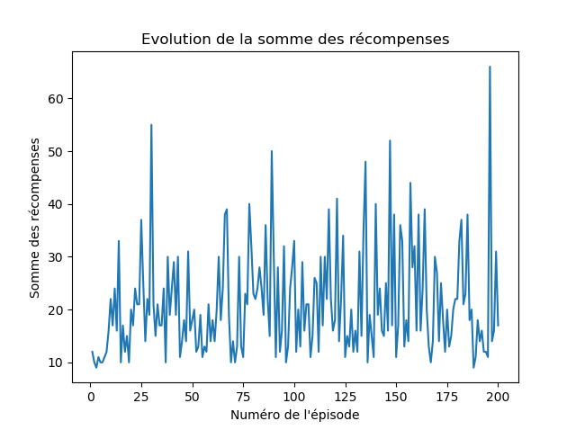

# TP Apprentissage Profond par Renforcement

## Auteurs

- Julian Bruyat 11706770

- Jean-Philippe Tisserand 11926733

## Environnement virtuel
- instalation : `python3.6 -m  venv .`
- activation : `source /bin/activate`
- desactivation : `deactivate`
- exportation des packages : `pip freeze > requirements.txt`
- importation des packages : `pip install -r requirements.txt`

## Préliminaires

Ce TP se repose sur l'utilisation de réseaux neuronaux profonds.

N'ayant jamais réalisé ce type de neurones de manière pratique auparavant, nous
proposons un simple script python qui démontre comment en mettre un en oeuvre
dans `XORLearn.py`.

## Partie 1 : CartPole

Le but de cette partie est de créer un agent évoluant dans l'environnement
*CartPole*.

Le CartPole est un jeu où nous contrôlons un chariot sur lequel est posé une
perche en équilibre. Le but est de déplacer ce chariot à gauche ou à droite
de sortes que le poteau reste le plus longtemps possible droit.

Le réseau neuronal du CartPole et son exécution sont implémentés dans 
le fichier `DeepQLearning.py`. Il peut être exécuté en exécutant le fichier
tout en prenant bien soin que la constante `ATARI` soit égale à `False`.

### Buffer

Un buffer est utilisé par l'agent d'une taille choisie à la construction de
l'agent.

Le bufffer est implémenté comme une liste dont les éléments sont réecrits
lorsque le nombre d'éléments dépasse la taille du buffer.

### Stratégie d'exploration

Deux stratégies d'exploration sont implémentées :
- L'Epsilon exploration
- L'exploration de Boltzmann.

La stratégie d'exploration est passée lors de la construction de l'agent.
Nous nous sommes focalisés sur l'utilisation de la méthode d'exploration
epsilon.

## Construction du réseau neuronal

Notre implémentation s'est faite en permettant à l'utilisateur de modifier via
les hyperparamètres le nombre de neurones dans les couches cachées. Tous les
hyperparamètres sont placés en haut du code excepté la stratégie d'exploration
et sont des constants que l'utilisateur peut modifier avant d'exécuter le code.

La seule possibilité proposée dans le sujet qui n'est pas implémentée pour le
CartPole est la mise à jour au cours du temps du réseau de neurones cibles :
seule la mise à jour tous les N apprentissages est proposée.

Nous exposons ici la somme des récompenses (le nombre de pas avant de perdre)
avec 200 épisodes, gamma = 0.01, un taux d'apprentissage de 0.01, des samples
de 32 extrait des 100000 dernières expériences, 3 neurones cachés et une copie
du réseau de neurones cible (réseau utilisé pour calculer le Qmax de l'état
suivant) tous les 10 batchs. Nous avons également expérimenté le paramètre de
réduction du taux d'apprentissage au cours du temps `weight_decay` de
l'optimiseur `Adam`) afin de justifier d'avoir un fort taux d'apprentissage
au début tout en pouvant apprendre des comportements plus subbtiles

En jouant avec ces hyperparamètres, nous ne sommes pas parvenus à trouver des
résultats très concluants avec une stabilité du cartpole (nous nous attendions
à pouvoir survivre en général au moins 30 étapes, contre 20 environ ici)

Nous savons que l'agent apprend car dans des situations courantes,
il possède un comportement lui permettant de tenir très longtemps, mais
de nombreuses situations lui échappent.

## Partie 2 : Atari : Breakout (casse brique)

Pour filtrer l'environnement, nous avons utilisé le wrapper `AtariPreprocessing`
qui effectue toutes les transformations dont nous avons besoin (passage de 4
frames, redimensionner en 84x84, conversion en niveaux de gris et normalisation
des couleurs).

Nous utilisons le *wrapper* `FrameStack` afin de garder les 4 dernières situations
dans un état afin de pouvoir conserver une chronologie des évènements (nous ne
disposons ici que de l'image de l'écran, alors que dans le CartPole nous avions
également la vitesse du bâton. Nous avons donc besoin de reconstituer ici au
moins le mouvement de la balle).

Nous avons ensuite essayé d'appliquer des réseaux convolutionnels. Si nous avons
trouvé la syntaxe pour en implémenter, nous ne sommes pas parvenus à en appliquer
de manière efficace, c'est-à-dire en ayant des un réseau neuronal qui apprendrait
en un temps acceptable.

Notre implémentation se repose sur l'ajout de couches convolutionnelles
avant les couches linéaires.
